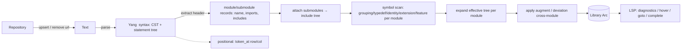

# yrepo — architecture

> **Status:** v1 implemented (2026-09-04); v1.1 adds the public statement-tree
> syntax view (§7, D11); v1.2 exposes comments (§7, D12); v1.3 adds identity
> derivation & typedef-chain resolution with existence diagnostics and
> completion candidates (§7, D13); v1.3.1 detects circular chains of imports
> (§4/§8, D14); v1.4 exposes the grammar-precise raw token stream — keywords,
> identifiers, quoted strings, numbers, booleans and `+` operators — as a
> superset of comments, ready to feed LSP semantic tokens/highlighting (§7,
> D15). Integration tests (`tests/NNN_*.rs`) and unit tests pass.
> Decisions are recorded in the [decision log](#decision-log) (D1–D17).
>
> v1.5 indexes `extension`/`feature` **symbols** (§7, D16): a module exposes
> them and a `prefix:name` usage resolves through the import to the definition
> — the data goto/hover relies on. It also hardens the effective tree (§8,
> D17): an `rpc`/`action` always exposes an `input` and an `output` schema node
> (empty when omitted in source), and module-level `augment`s are applied to an
> order-independent fixpoint so one augment may target a node another augment
> installs. A post-v1.4 audit additionally produced A2/A5/A6 (recorded after
> the decision log): deviation target-only resolution, and `config`-aware
> list-`key` validation.

---

## 0. Why a rewrite

The first implementation (one large `lib.rs`) grew real behavior — tree-sitter
parsing, a facade (`upsert`/`resolve`/`compile`), a per-document model with
token lookup, a schema compiler, imports/includes, augment/deviation,
diagnostics — but its public shape drifted from the intended plan, and a few
structural issues emerged:

- everything lived in one file; no clear boundary between *syntax* and *semantics*;
- the error model was inconsistent: user-content problems were sometimes
  returned as `Err` and sometimes reported as diagnostics;
- the intended `Repository / Text / Yang / Library` layering was never explicit.

The rewrite fixes these up front.

## 1. Goals

Provide an [LSP](https://microsoft.github.io/language-server-protocol/)-friendly
**YANG schema toolkit** (parse + resolved semantic model). The typical workflow:
a client opens/edits/closes documents by `url`, and after each change wants:

- **diagnostics** for the affected document(s), and a *consistent* snapshot of
  the whole resolved workspace (the "library");
- **positional queries**: token at `(row, col)` → statement/role, jump-to-def,
  hover, autocomplete, rename;
- semantic lookups: module/submodule/typedef/grouping/identity/extension/feature,
  prefix→module.

Constraints:

- `*.yang` only for now; `*.yin` may come later.
- Pure **library** crate. Optionally a tiny demo binary, no required CLI.
- Incremental-friendly by design (see §6).

## 2. Non-goals (v1)

- `.yin` / XML serialization.
- Data-instance trees, datastores, XPath data evaluation.
- Fetching modules over the network.
- Full RFC 7950 conformance suite: we validate pragmatically, tolerantly.

## 3. Vocabulary

| term | meaning |
| --- | --- |
| `Repository` | owns the open documents of a workspace: `url → entry(text, parsed…)`. |
| `Text` | raw source for one `url` with line/offset access. |
| `Yang` | **syntactic** view of one parsed file: `module` vs `submodule`, name/revision/belongs-to, header (namespace/prefix/imports/includes), CST + statement tree. Pure syntax, no cross-file semantics. |
| `Library` | the **resolved semantic database** for the compiled workspace (cheap to snapshot → `Arc`). Modules + submodules, symbol tables, effective schema trees, applied augment/deviation, reverse prefix map. |
| `Diagnostic` | severity + range + code + message. Represents **user-content** problems; never fatal. |
| `Outcome` | `(Option<Arc<Library>>, Vec<Diagnostic>)`. You *always* get diagnostics; the `Library` is `None` only when no module could be compiled. |
| `Argument` | the **logical** argument of a statement: dequoted, `+`-fragments joined, plus the byte span. Names/paths are derived from this. |
| `Location` | a position in a physical document: `url` + byte range. Nodes/search results record *which file* they came from — a module file **or** a submodule file. |

## 4. Pipeline



Key structural ideas:

1. **Syntax never throws.** The parser always yields *something* (best-effort
   CST + diagnostics from error recovery). Nothing downstream errors merely
   because a file is malformed.
2. **Two-phase compile**, so cross-module references need no fixed order:
   - phase 1: parse every header → registry of module/submodule names +
     revisions, prefixes, and includes; detect *circular chains of imports*
     (RFC 7950 §5.1 forbids them) and *include cycles* — both reported as
     diagnostics (D14).
   - phase 2: compile bodies. Bodies reference imported definitions by name
     and resolve lazily through the registry, so no ordering constraint is
     imposed on topologically independent modules.
3. **Submodule modeling**: submodule files are their own editor documents but
   semantically belong to a parent module and contribute schema into it. The
   `Library` stores **modules**; each module folds in its included submodules,
   yet every node keeps the `Location` of the physical file it was defined in
   (D6).
4. **Augment / refine / deviation target resolution**: those statements
   reference nodes by (absolute/descendant) schema-nodeid, possibly
   prefix-qualified into imported modules. Resolution splits the path, resolves
   the first prefix through the target module's scope, then walks effective
   children. Because argument text can be split across `+`-concatenated quoted
   fragments, the syntax layer exposes the logical `Argument` (D4/D9).
5. **Caret-based statement completion (deferred)**: driven purely from the CST.
   A caret in the gap after `;`/`{` or before a sibling statement is inside no
   token — find the deepest statement whose child-list contains the caret, then
   filter its allowed children by the RFC 7950 statement grammar. The literal
   `;`/`{`/`}` tokens are never needed.
6. **Augment-argument completion (deferred)**: a *semantic* completion that runs
   over the effective schema tree — offering, at each segment, the valid
   children/prefixes — so writers need not hand-spell paths through nested
   `uses`/groupings, shorthand `case`s, and third-party augments.

## 5. Module layout (as implemented)

```bash
src/
  lib.rs       facade + re-exports: Repository, Outcome, Library, diagnostics,
               schema types (public API)
  text.rs      Text: raw source + line/offset access
  syntax.rs    syntax layer: tree-sitter CST, Statement tree, logical
               Argument, caret tokens  [the only tree-sitter code, D2]
  yang.rs      Yang: syntactic per-doc model + header extraction
  compile.rs   compiler: classification, submodule attach, symbol scan,
               effective-tree expansion, augment/deviation, validation
  schema.rs    semantic model: ModuleRecord, SchemaNode arena, symbols
  library.rs   Library (resolved DB) + Outcome + queries
  value.rs     leaf value typing: TypeFacets capture + ValueType (D19)
  diag.rs      Diagnostic / Severity / DiagnosticCode
```

Graph resolution lives inside `compile.rs`; LSP-ish queries on `library.rs`.
Separate `repo.rs`/`parse.rs`/`graph.rs`/`query.rs`/`diagnose.rs` modules were
considered but folded in — the files above stayed small enough that extra
modules would add ceremony without clarity.

## 6. Incremental / snapshot strategy

- `Repository::compile()` recompiles the whole workspace and returns a fresh
  snapshot (`Arc<Library>`). v1 ships whole-workspace recompile (D5).
- The pipeline is shaped so per-document caching + a dirty-set can be added
  later without redesign: parsing happens once per `upsert`, and symbol tables
  are order-independent.

## 7. Public API (as implemented)

| concern | API |
| --- | --- |
| document mgmt | `Repository::new()`, `upsert(url, source)`, `remove(url) -> bool`, `contains(url)`, `len()` |
| compile workspace | `Repository::compile() -> Outcome` (`Option<Arc<Library>>`, `Vec<Diagnostic>`) |
| module lookup (latest) | `Library::module(name)` — rustdoc: resolves the latest revision; a module without `revision` is valid and registered under the empty revision (D7) |
| module lookup (exact) | `Library::module_rev(name, rev)` — rustdoc: exact `(name, rev)`; `None` if not loaded (D7) |
| submodule lookup | `Library::submodule(name)` — record has name, rev, belongs-to parent, url, parent module it was folded into (D6) |
| type lookup | `Library::search_type(module, type) -> Option<&Typedef>` |
| grouping lookup | `Library::search_grouping(module, grouping)` |
| identity lookup | `Library::search_identity(module, identity)` |
| extension lookup | `Library::search_extension(module, extension) -> Option<&ExtensionDef>` — record carries the declared `argument` name (D16) |
| feature lookup | `Library::search_feature(module, feature) -> Option<&FeatureDef>` (D16) |
| type resolution (chain) | `Library::resolve_type(module, type) -> Option<TypeResolution>` — typedef chain down to a builtin, cross-module; `typedefs` steps + `builtin` + `complete` (D13) |
| identity resolution | `Library::resolve_identity(module, name) -> Option<IdentityResolution>` — the identity + its `base` ancestry (D13) |
| derived identities | `Library::derived_identities(module, base) -> Vec<IdentityRef>` — the `identityref { base … }` value set (base + everything derived) (D13) |
| type completion | `Library::type_candidates(module) -> Vec<TypeCandidate>` — builtins + local typedefs + imported `prefix:typedef` (D13) |
| identity completion | `Library::identity_candidates(module) -> Vec<String>` — own identities + imported `prefix:name` (D13) |
| prefix→module | `Library::prefix_to_module(module, prefix)` — own prefix, imports, and folded `belongs-to` prefixes |
| resolve schema-nodeid | `Library::resolve_abs_schema_node_id(module, path) -> Option<&SchemaNode>` — goto/hover on augment/refine/deviation args (D9) |
| ns → modules | `Library::modules_by_namespace(ns) -> Vec<&ModuleRecord>` — an XML element namespace may be shared by several modules (D18) |
| schema nodeid | `Library::schema_nodeid(module, id) -> Option<String>` — canonical absolute nodeid **including** `choice`/`case`/`input`/`output` wrappers, each segment prefixed by its instance module (D18) |
| data-visible children | `ModuleRecord::data_children(id) -> Vec<NodeId>` / `data_child(id, name)` — instance-visible children through `choice`/`case` wrappers; an rpc/action's body lives under `rpc_input(id)` / `rpc_output(id)` (always present) (D18) |
| value typing | `Library::value_type(module, id) -> Option<ValueType>` — reduce a leaf/leaf-list type through the typedef chain to a scalar builtin, accumulating facets (`length`/`pattern`/`range`, `enum`/`bit` members, `leafref` `path`, `identityref` `base`); re-exported `TypeFacets` / `ValueType` (D19) |
| identityref check | `Library::check_identityref(module, base, value) -> IdentityStatus` — `Ok` / `UnknownIdentity` / `NotDerived`; semantic membership of an identityref value against its `base` (D19) |
| syntax: statement tree | `Repository::statement(url) -> Option<&Statement>` — the document's root `module`/`submodule` statement; enumerate the whole tree via `.children` / `.preorder()` (D11) |
| syntax: caret node | `Repository::statement_at(url, row, col) -> Option<&Statement>` — the narrowest statement under the caret; read its argument string / spans for precise goto/hover (D11) |
| syntax: comments | `Repository::comments(url) -> Option<&[Comment]>` — comments in source order (the statement tree does not model them); each has a byte `range`, a `Line`/`Block` `kind`, and raw `text` (D12) |
| syntax: tokens | `Repository::tokens(url) -> Option<&[Token]>` — the grammar-precise raw token stream: `Keyword`/`Identifier`/`String`/`Number`/`Boolean`/`Operator`/`Comment`/`Other`, in source order with disjoint spans; superset of comments (D15) |
| token at pos | `Repository::token_at(url, row, col) -> Option<TokenHit>` — narrowest statement kind + Keyword/Argument/Other spot (cheap classification) |
| diagnostics | `Outcome.diagnostics` / `Diagnostic { url, range, severity, code, message }` — never `Err` on content (D3) |

The public statement tree (re-exported `Statement` / `Argument` / `StatementEnd`,
D11) is tree-sitter-free: every `Statement` carries its `kind`, the byte spans
of its `keyword` and argument, the logical `Argument` (dequoted, `+`-fragments
joined — the `logical` text plus the raw `range` it occupied), how it terminates
(`StatementEnd::Semicolon` vs `Braces`, with exact `;`/`{`/`}` spans so fold and
format need not rescan source), and its `children`. Positions are byte offsets in
the source of the exact `url` passed to `upsert`.

Comments are *not* in the statement tree; `Repository::comments` exposes them
as a document-ordered list of `Comment { range, kind, text }`, produced from the
same single parse. A formatter must splice them back in (never delete), and
highlight colors them `comment` (D12).

`Repository::tokens` (D15) exposes the finer-than-statement stream the
statement tree deliberately drops: statement keywords, identifiers, quoted
strings (whole span incl. quotes), unquoted numbers in `range`/`length`/
`fraction-digits`/values, `true`/`false`, and the `+` concatenation operator.
Each `Token { kind, range, text }` is grammar-precise and spans are disjoint and
source-ordered, so it maps directly to LSP `textDocument/semanticTokens` with no
re-lexing. Tokens are a superset of comments (a comment leaf is one `Comment`
token). Known grammar quirk: a quoted `range`/`length` argument is *not* a
single `quoted_string` node — tree-sitter-yang lexes its content as numbers and
punctuation (so `range "1..10"` yields `1`/`10` as `Number`, with the quote
chars and `..` as `Other`). That is exactly the desired "numbers in range"
coloring; consumers wanting the whole quoted run use the statement
`Argument.range` instead.

Effective nodes (`SchemaNode`) expose: kind, name, parent/children ids, defining
`Location`, `uses`-site `Location` (grouping-born nodes), **origin module** (the
defining module) and **instance module** (the module owning the node's namespace
in an instance document — equal for direct/augment nodes, the *using* module for
grouping-born nodes, D18), keys / is-key, config / mandatory / presence /
default / status / ordered-by / min/max-elements, type name, the facets captured
on the node's own `type` statement (`type_facets()`, D19), and the removed flag.

`extension`/`feature` statements are **symbols** like typedefs/groupings: the
defining module indexes them (`ModuleRecord::extensions()`/`features()`,
re-exported `ExtensionDef { name, defining, argument }` / `FeatureDef { name,
defining }`) and a `prefix:name` usage resolves through the import to the
definition (`Library::search_extension`/`search_feature`) — the data
goto/hover relies on (D16). In the statement tree an extension *usage* is an
`unknown_stmt` whose head `prefix:name` acts as its keyword span.

Two effective-tree guarantees underpin `augment` resolution (D17): an
`rpc`/`action` always has an `input` and an `output` schema node — empty when
the source omits them — so augments may target an implicit `input`/`output`;
and module-level `augment`s are applied to a **fixpoint**, so one augment may
target a node installed by another augment regardless of document order.

Deferred (documented, not implemented): `complete_abs_schema_node_id`
(augment-argument path completion), statement completion, per-doc incremental
cache, `.yin`, XPath/leafref **evaluation** and leafref value chasing. RFC 7950
restriction **facets** are captured and exposed (`TypeFacets`/`ValueType`, D19)
and semantic `identityref` membership is implemented (`check_identityref`);
their *enforcement* (value diagnostics) is the consumer's job — the sibling
netconf-language-server tracks it as D31.

## 8. Decision log

| # | decision |
| --- | --- |
| D1 | Layered types internally; public v1 surface = `Repository` (doc mgmt + `compile`) and `Library` (queries). `Text`/`Yang` are `pub(crate)`. |
| D2 | Keep **tree-sitter** (external grammar) as the CST provider behind the syntax layer; it is the only tree-sitter-dependent code. |
| D3 | User-content problems are always `Diagnostic`s, never `Err`; `Result` is reserved for programmer/invariant errors. |
| D4 | v1 semantic scope: data nodes + rpc/action/notification + typedef/type + grouping/uses + identity + augment + deviation, **and** resolution of augment/refine/deviation target schema-nodeids (for goto/hover) incl. `+`-concatenated logical `Argument`s. |
| D5 | Whole-workspace recompile in v1; pipeline shaped so per-doc caching/dirty-set can be added later. |
| D6 | Compile unit = module (submodules folded in), but nodes/search results carry the `Location` of the physical defining file; `Library::submodule` returns the submodule record for goto on `include` args. |
| D7 | `revision` is optional (revision-less module is valid). Internally keyed by exact `(name, rev)` + "latest" index. Public API exposes **both** a name-only lookup (`module(name)`, → latest) and an exact one (`module_rev(name, rev)`); rustdoc on each. Import/include `revision` pins validated internally → diagnostics. |
| D8 | Package + lib name: **`yrepo`**. |
| D9 | `Library`'s schema tree is the **effective/expanded tree**: groupings instantiated per `uses`, uses-augment/refine applied, shorthand `case`s materialized, submodules inlined, cross-module `augment`s applied; each effective node keeps its defining `Location` (+ `uses` site for instantiated nodes). One tree powers augment/refine/deviation resolution, augment-arg path completion, hover. `resolve_abs_schema_node_id` is public on `Library`. |
| D10 | **Grammar fix (external, sibling repo):** `tree-sitter-yang`'s `submodule_stmt` omitted `body-stmts`; regenerated after adding `$._body_stmt` to `grammar.js` so submodules can carry data nodes. `tests/sample_yang/import-base.yang` corrected so `definitions` is a `grouping` (its `uses ib:definitions` in `import-ext.yang` otherwise has no target). |
| D11 | Public **syntax view**: `Text`/`Yang` stay `pub(crate)` (D1), but the tree-sitter-free `Statement`/`Argument`/`StatementEnd` are re-exported and `Repository` exposes `statement(url)` (whole document tree) and `statement_at(url,row,col)` (narrowest statement under the caret). LSP fold/format/highlight/precise goto-hover can now enumerate statements and read argument strings without a second parse; `token_at` remains the cheap kind+spot classification. Each `Statement` records its terminator (`;` vs `{…}`, exact spans) at parse time because a grammar-node span may run past the terminator over inter-statement whitespace. |
| D12 | **Comments are exposed from `yrepo`** (`Repository::comments(url) -> Option<&[Comment]>`, re-exported `Comment { range, kind, text }` / `CommentKind`). The `Statement` tree deliberately models only statements; comments are grammar extras that live between statements and inside blocks. They are collected from the retained CST in the same single parse, so they are string-aware by construction (a `//`/`/* */` inside a quoted argument is not a comment). This unblocks format (splice comments back in), highlight (`comment` color), and comment-out quick-fixes without a second parse or a hand-rolled lexer in the LSP consumer. Grammar-precise *literal* tokens (quoted runs, `+`, numbers, booleans) are deliberately left for a later token stream if the LSP needs finer-than-statement coloring. |
| D13 | **Identity derivation & typedef chains (existence + chain resolution).** Symbol records capture an identity's `base` and a typedef's `type`. Compile emits existence diagnostics (`UnresolvedIdentity`, `UnresolvedTypedef`, `UnresolvedPrefix`) for unresolved bases and out-of-scope leaf/leaf-list type refs (module-not-loaded cases are left to `UnresolvedImport` to avoid double-reporting). `Library` exposes `resolve_type` (typedef chain → builtin), `resolve_identity` (ancestry), `derived_identities` (identityref value set), and `type_candidates`/`identity_candidates` (completion). RFC 7950 **restriction-subset semantics** (range/length/pattern/enum/bits) are deliberately not implemented. |
| D14 | **Import cycles are illegal.** RFC 7950 §5.1 forbids circular chains of imports (`a` imports `b` ⇒ `b` must not import `a`). Both import cycles (`ImportCycle`) and include cycles (`IncludeCycle`) are reported as diagnostics. Corrects the earlier draft statement that "import cycles are legal". |
| D15 | **Raw token stream** (`Repository::tokens(url) -> Option<&[Token]>`, re-exported `Token { kind, range, text }` / `TokenKind`). The `Statement` tree (D11) and `comments` (D12) expose structure and comment ranges but drop the grammar's literal tokens (statement keywords, argument identifiers, quoted strings, unquoted numbers, booleans, `+`). `tokens` provides the grammar-precise lexical stream from the same single parse — disjoint, source-ordered spans, a superset of comments — enough for LSP `semanticTokens`/highlighting without a second parse or a hand-rolled lexer. Classification is by CST leaf kind (`comment`, `identifier`, `integer_value`/`decimal_value`, `boolean`/`true`/`false`, `+`, `*_keyword`, reserved argument words) with a quoted-text fallback for monolithic tokens such as the `namespace` URI. `TokenKind` is `#[non_exhaustive]`. Chosen over a consumer-side lexer or re-exposing raw tree-sitter. **Grammar quirk:** quoted `range`/`length` args are lexed by tree-sitter-yang as numbers + punctuation, not one `quoted_string` (verified by CST sexp dump), which suits "numbers in range" coloring. |
| D16 | **`extension`/`feature` symbols.** `extension` and `feature` statements are symbols like `typedef`/`grouping`/`identity`: indexed in `schema.rs` (re-exported `ExtensionDef { name, defining, argument }` / `FeatureDef { name, defining }`) and exposed via `ModuleRecord::extensions()`/`features()`. A `prefix:name` *usage* of an extension resolves through the import to its definition — `Library::search_extension`/`search_feature` — the data goto/hover relies on. In the statement tree an extension usage is an `unknown_stmt` whose head `prefix:name` is treated as its keyword span. `feature` is indexed; `if-feature` semantics are not modelled. |
| D17 | **Effective-tree guarantees for cross-module resolution.** (1) An `rpc`/`action` always has an `input` and an `output` schema node — synthesized empty when the source omits the block — so augments may target an implicit `input`/`output` (RFC 7950 §7.14/§7.15; regression: `ietf-ipv4/ipv6-unicast-routing` augments). (2) Module-level `augment`s are applied to a **fixpoint**: passes keep going until nothing new applies, so an augment may target a node that *another* augment installs regardless of upsert order (regression: `aug-chain-c` targeting `aug-chain-a`'s node — the real-world `ietf-ip-mounted`/`ietf-interfaces-mounted` case). Resolution thus depends only on the final schema, never on document order. |
| D18 | **Instance-data queries.** Every node exposes its **instance module** — the module whose namespace owns it in an instance document; equal to `origin_module` except for nodes instantiated from a cross-module grouping via `uses`, where it is the *using* module (RFC 7950 §7.13). `ModuleRecord::data_children`/`data_child` give the instance-visible children through `choice`/`case` wrappers (data path ≠ schema path); an `rpc`/`action`'s body is reached via `rpc_input`/`rpc_output` (always present). `Library::modules_by_namespace` maps an XML element namespace to modules (several may share one); `Library::schema_nodeid` renders the canonical wrapper-inclusive absolute nodeid, segments prefixed by their instance module. Backs the sibling netconf-language-server's instance mapping (its D29/D30). |
| D19 | **Leaf value typing + semantic `identityref`.** The compiler captures a `type` statement's facets on the leaf **and** each typedef (`TypeFacets`); `Library::value_type` reduces a leaf/leaf-list type through the typedef chain to a scalar `ValueType`, accumulating `length`/`pattern`/`range`, `enum`/`bit` members (most-derived wins), `leafref` `path`, and the `identityref` `base`. `union` is classified but never *checked* (RFC 7950 §9.12). `Library::check_identityref` gives semantic membership (`IdentityStatus`). yrepo captures/exposes; *enforcement* is the consumer's (netconf-language-server D31). |

The audit decisions referenced by code comments and tests (`A2`, `A5`, `A6`)
are recorded here under their original labels so those references stay valid:

| # | decision |
| --- | --- |
| A2 | A `deviation` needs only its **target** to resolve (so goto/hover on the argument works); no `deviate` sub-statement semantics are modelled beyond `not-supported` removal. The target may live in a different (base) module and resolves through that module's effective tree. |
| A5 | `config` is inherited from the nearest ancestor that sets it and `config false` propagates down the subtree. A key-less `list` that is `config false` (itself or via an ancestor) — or that lives in `rpc`/`action`/`notification` content, which is never configuration (RFC 7950 §7.1) — may omit `key`. |
| A6 | A key-less `list` born from a `grouping` is judged only when the grouping itself pins an explicit `config` (on the list or an ancestor inside the grouping). If the grouping leaves `config` to the uses-site it is not flagged — the grouping author is responsible for using it only in a `config false` tree. |

## 9. Notes / simplifications in v1

- `refine` / `uses-augment` are applied best-effort.
- Identity derivation and typedef-chain **existence/resolution** are
  implemented (D13). RFC 7950 restriction **facets** (range/length/pattern/
  enum/bits) and the `identityref` `base` are now **captured and exposed** (D19),
  and semantic `identityref` membership is implemented (`check_identityref`),
  but yrepo does not *enforce* values — that lives in the consumer
  (netconf-language-server D31). Leafref XPath evaluation and deviation
  `replace` semantics are not implemented.
- `extension`/`feature` are indexed as symbols (D16); `if-feature` and
  extension-usage semantics beyond the declared `argument` name are not
  modelled.
- Deviation application is deliberately shallow (A2): only the target must
  resolve, and only `not-supported` removes nodes from the effective tree.
- Reserved-but-not-implemented items are listed at the end of §7.
